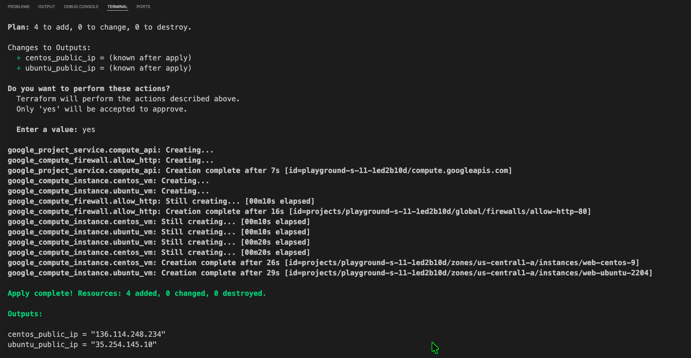
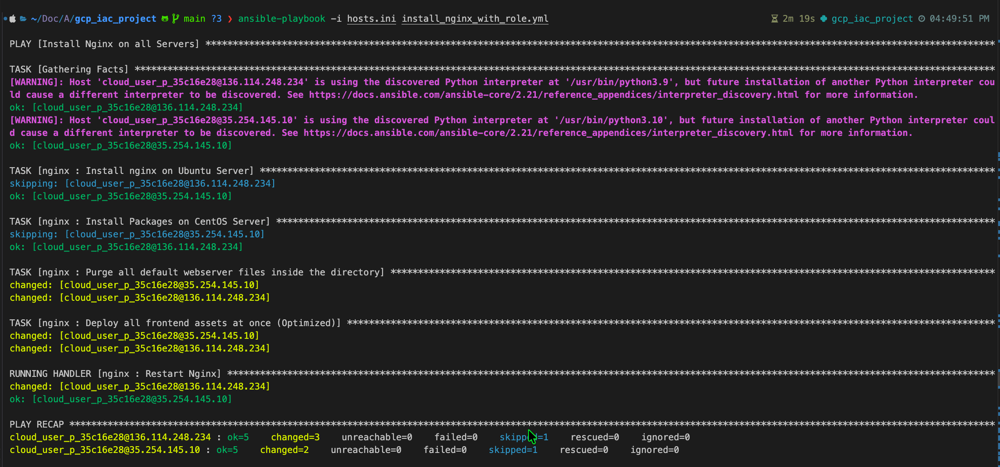
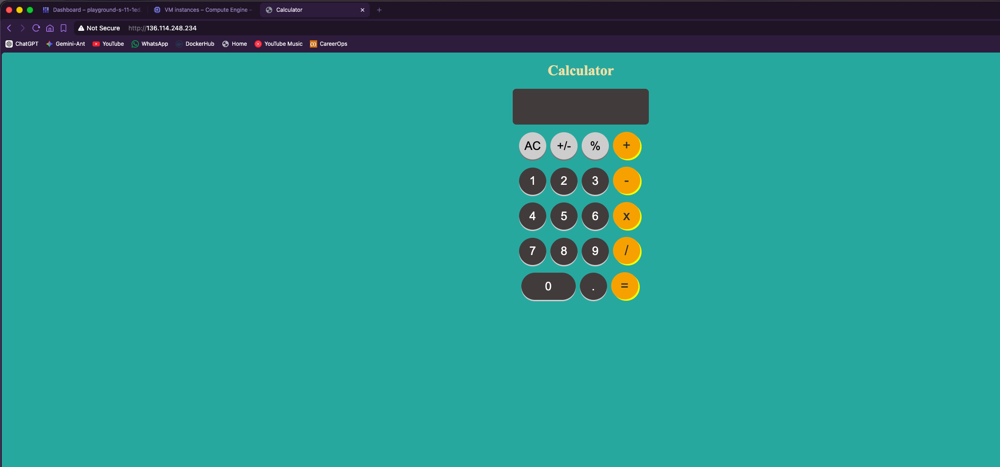

# Multi-OS Cloud Infrastructure Pipeline — GCP, Terraform, Ansible

An end-to-end Infrastructure-as-Code pipeline that provisions a dual-OS virtual machine cluster on Google Cloud Platform and deploys a live web application across both nodes — fully automated, zero manual SSH, zero hardcoded credentials.

---

## What This Project Actually Does

Most IaC tutorials stop at "here's how to create a VM." This project goes the full distance: Terraform builds the machines, Ansible walks into them and configures them, and the result is a live app running simultaneously on two completely different Linux distributions — deployed by the same playbook.

The core engineering challenge here is the **OS boundary problem**. Ubuntu and CentOS have different package managers, different default web roots, and different service names. A naive approach writes two separate playbooks, one per OS. That's maintenance debt waiting to happen. This project solves it with a single playbook that uses OS family detection to route tasks correctly at runtime.

---

## Repository Structure

```
gcp_iac_project/
├── main.tf                          # Terraform — provisions all GCP infrastructure
├── install_nginx_with_role.yml      # Ansible — current playbook, role-based
├── install_packages.yml             # Ansible — v1, direct tasks (kept for reference)
├── roles/
│   └── nginx/                       # Reusable Ansible role for web deployment
│       ├── tasks/                   # Cross-OS installation and deployment logic
│       ├── handlers/                # Idempotent Nginx restart trigger
│       ├── files/                   # Calculator web app (HTML, CSS, JS)
│       ├── vars/                    # OS-specific path mappings
│       ├── defaults/
│       ├── meta/
│       └── tests/
├── .gitignore                       # Blocks keys, state files, hosts.ini from version control
└── README.md
```

**Not in the repo (intentionally):**
- `hosts.ini` — contains live VM public IPs, git-ignored
- `terraform.tfvars` — contains project ID and SSH user, git-ignored
- `lab_start.sh` — local session bootstrapper, git-ignored
- `.terraform/`, `*.tfstate` — provider cache and state, git-ignored

---

## The Two-Layer Architecture

### Layer 1 — Infrastructure Provisioning (`main.tf`)

Terraform is responsible for everything that exists in GCP. It enables the Compute Engine API, provisions two VMs in the default VPC — one Ubuntu 22.04 LTS (`web-ubuntu-2204`) and one CentOS Stream 9 (`web-centos-9`) — opens port 80 via a firewall rule scoped to network tags, and outputs the public IPs of both machines.

**Nothing in the cloud exists unless Terraform created it.**

### Layer 2 — Configuration Management (`install_nginx_with_role.yml` + `roles/nginx/`)

Once the VMs are alive, Ansible takes over via the `nginx` role. It detects the OS family on each host, routes the package installation to the correct module (`apt` for Ubuntu, `dnf` for CentOS), purges the default web server files, deploys the calculator app assets, and restarts Nginx — but only if the files actually changed.

**One playbook. Two operating systems. No manual steps.**

---

## Deployment Evidence

### Terraform Apply — 4 Resources Created

Terraform provisioned the Compute Engine API, HTTP firewall rule, and both VM instances in under 30 seconds. Both public IPs were emitted as outputs.



```
Apply complete! Resources: 4 added, 0 changed, 0 destroyed.

Outputs:
centos_public_ip  = "136.114.248.234"
ubuntu_public_ip  = "35.254.145.10"
```

---

### Ansible Playbook Run — Conditional Logic Firing Correctly

The key thing to observe in this output: the Ubuntu task is **skipped** on the CentOS host, and the CentOS task is **skipped** on the Ubuntu host. That's the OS-detection logic working exactly as designed. Both hosts then run the purge, asset deployment, and handler in unison.



```
PLAY RECAP
136.114.248.234 : ok=5  changed=3  unreachable=0  failed=0  skipped=1
35.254.145.10   : ok=5  changed=2  unreachable=0  failed=0  skipped=1
```

Zero failures. Zero unreachable. Both nodes configured.

---

### Live App — Calculator Running on CentOS VM

Hitting the CentOS VM's public IP in the browser serves the deployed calculator application directly over HTTP.



---

## 🛠️ Local Workspace & Lab Automation

The lab environment is ephemeral — new GCP Project ID every session, credentials rotate daily, and leftover state files cause real problems if not cleared. A local bootstrapper script (`lab_start.sh`) handles the entire session startup automatically.

Running `source lab_start.sh` executes this pipeline:

**Step 1 — Dynamic ID Mapping:** Prompts for the day's Project ID, writes a local git-ignored `terraform.tfvars`. No file ever needs to be manually edited between sessions.

**Step 2 — Contextual Auth:** Triggers `gcloud auth login` and configures Application Default Credentials for Terraform's programmatic access.

**Step 3 — State Purge:** Wipes yesterday's `.terraform/` cache and `*.tfstate` files so ghost infrastructure can't interfere with a clean run.

**Step 4 — Environment Check:** Auto-activates the Python `.venv` if present, ensuring Ansible's GCP dependencies are always loaded.

**Step 5 — Runway Init:** Runs `terraform init` and prints the plan so the current state is visible before anything is applied.

```
  [ Ephemeral Lab Boot ] ──> Run: source lab_start.sh
                                   │
         ┌─────────────────────────┴─────────────────────────┐
         ▼                                                   ▼
  [Local Auth & Variables]                            [State Cache Purge]
  - gcloud OAuth / ADC Login                          - Wipes yesterday's tfstate
  - Generates local tfvars                            - Resets backend tracking
         │                                                   │
         └─────────────────────────┬─────────────────────────┘
                                   ▼
                        [Terraform Init & Plan]
                        - Installs provider plugins
                        - Displays deployment runway
```

---

## Key Engineering Decisions

**Why two playbooks in the repo?**
`install_packages.yml` is the v1 — direct tasks, no role structure. `install_nginx_with_role.yml` is the refactored version that uses the `nginx` role. The v1 is kept deliberately as a visible record of the refactor. Anyone reading the commit history can trace exactly how the project evolved from flat tasks to a reusable role structure.

**Why a single playbook for both OS types?**
Separate playbooks per OS create drift. They start identical, diverge over time, and eventually contradict each other. One playbook with conditional routing means one source of truth, always.

**Why `hosts.ini` in `.gitignore`?**
It contains live public IPs tied to an active GCP session. Committing it leaks infrastructure details and becomes stale the moment the lab session expires anyway. It gets regenerated locally every session from the Terraform outputs.

**Why a handler instead of always restarting Nginx?**
Unconditional restarts on every run cause unnecessary downtime. The handler fires only when the deployed files actually changed — that's idempotent behavior, which is the correct default for configuration management.

---

## Skills Demonstrated

- Terraform resource provisioning, data blocks, output maps, GCP API enablement
- Ansible multi-OS conditional tasks, role structure, handlers, file modules
- GCP Compute Engine instance provisioning and VPC firewall configuration
- Git upstream tracking and credential-safe `.gitignore` enforcement
- Ephemeral lab environment management through shell automation
